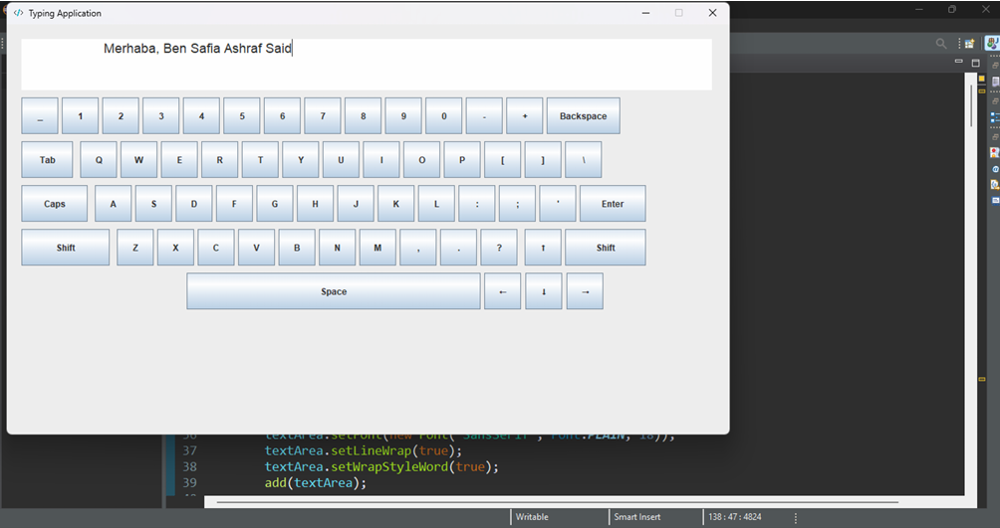

# Typing Tutor (Java)

A graphical typing tutor application designed to help users improve their typing skills with letters, numbers, and special characters.  
Built using **Java** and the **Swing** library to provide an interactive and user-friendly GUI.

## 🎯 Project Objective

The goal of this project is to offer users a practical tool to train their typing efficiency.  
It simulates a full QWERTY keyboard layout with interactive buttons and real-time feedback.

## 🛠️ Tech Stack

- **Language:** Java  
- **GUI Framework:** Swing  
- **Main Class:** `TypingTutorFrame.java`  
- **IDE Used:** Eclipse / IntelliJ IDEA

## 🧩 Main Features

- Interactive keyboard with:
  - Letters, numbers, and special characters
  - Functional keys: Space, Enter, Backspace, Caps Lock, Shift
  - Arrow keys for cursor movement
- Real-time text input via `JTextArea`
- Visual feedback when keys are pressed
- Caps Lock toggle functionality
- QWERTY layout with horizontal alignment
- Modular methods for key creation and behavior

## 📦 Key Classes and Methods

- `TypingTutorFrame`: Main application window and logic
- `createKeyButton(char c, int x, int y)`: Creates standard key buttons
- `createSpecialButton(...)`: Builds special keys like Space and Enter
- `updateLetterKeys()`: Updates key labels based on Caps Lock state
- `changeButtonColor(JButton btn)`: Highlights pressed keys
- `createArrowButton(...)`: Enables cursor movement

## 🧪 Challenges & Solutions

- **Key alignment issues:** Solved by adjusting X-coordinates per row  
- **Caps Lock logic:** Refined to affect both key labels and typed text  
- **Arrow keys functionality:** Enabled using `setCaretPosition()`  
- **Shift key:** Currently visual only; future versions may support symbol input

## 📸 Screenshots



## 📁 File Structure

| File Name             | Description                          |
|----------------------|--------------------------------------|
| TypingTutorFrame.java| Main source code                     |
| 7468307.png           | App interface icon/screenshot        |
| Report.pdf            | Project documentation                |

## 🚀 How to Run

1. Clone the repository:
   ```bash
   git clone https://github.com/SafiSaeed21/TypingTutor_java.git

# تطبيق Typing Tutor (جافا)

تطبيق تعليمي يساعد المستخدمين على تحسين مهاراتهم في الكتابة على لوحة المفاتيح، من خلال واجهة رسومية تفاعلية مبنية بلغة **Java** باستخدام مكتبة **Swing**.

## 🎯 هدف المشروع

تطوير أداة تدريبية تتيح للمستخدمين ممارسة كتابة الحروف، الأرقام، والرموز الخاصة بشكل أكثر كفاءة، من خلال محاكاة لوحة مفاتيح كاملة بتصميم QWERTY.

## 🛠️ التقنيات المستخدمة

- **اللغة:** Java  
- **مكتبة الواجهة الرسومية:** Swing  
- **الملف الرئيسي:** `TypingTutorFrame.java`  
- **بيئة التطوير:** Eclipse / IntelliJ IDEA

## ✨ المميزات

- لوحة مفاتيح تفاعلية تشمل:
  - أزرار للحروف، الأرقام، والرموز الخاصة
  - أزرار وظيفية مثل: Space، Enter، Backspace، Caps Lock، Shift
  - أزرار الاتجاهات لتحريك المؤشر
- منطقة كتابة (`JTextArea`) لعرض النص المكتوب
- تغيير لون الأزرار عند الضغط لإعطاء تغذية بصرية
- دعم لتفعيل/إلغاء Caps Lock
- تنظيم الأزرار بشكل أفقي يحاكي لوحة المفاتيح الحقيقية

## 🧩 أهم الأصناف والدوال

- `TypingTutorFrame`: يحتوي على نافذة التطبيق والمنطق الأساسي
- `createKeyButton(char c, int x, int y)`: لإنشاء أزرار الحروف
- `createSpecialButton(...)`: لإنشاء الأزرار الخاصة مثل Space وEnter
- `updateLetterKeys()`: لتحديث الحروف حسب حالة Caps Lock
- `changeButtonColor(JButton btn)`: لتغيير لون الزر عند الضغط
- `createArrowButton(...)`: لإنشاء أزرار الاتجاه وتغيير موقع المؤشر

## 🧪 التحديات والحلول

- **عدم انتظام الأزرار:** تم حل المشكلة بتحديد نقطة بداية X مختلفة لكل صف  
- **منطق Caps Lock:** تم تحسينه ليؤثر على النص المكتوب وليس فقط شكل الأزرار  
- **أزرار الاتجاه:** أصبحت فعالة باستخدام `setCaretPosition()`  
- **زر Shift:** مضاف بصريًا فقط، وسيتم تطوير وظيفته في الإصدارات القادمة

## 📸 صور من التطبيق


## 📁 هيكل الملفات

| اسم الملف              | الوصف                                 |
|------------------------|----------------------------------------|
| TypingTutorFrame.java  | الكود الرئيسي للتطبيق                  |
| 7468307.png            | صورة توضيحية لواجهة التطبيق            |
| Report.pdf             | تقرير المشروع                         |

## 🚀 طريقة التشغيل

1. استنساخ المستودع:
   ```bash
   git clone https://github.com/SafiSaeed21/TypingTutor_java.git
